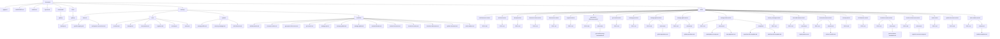

# llm-assets — File Structure

```mermaid
graph TD
    ROOT["llm-assets/"]

    ROOT --> GITIGNORE[".gitignore"]
    ROOT --> HANDOVER["HANDOVER.md"]
    ROOT --> MODEL["model.md"]
    ROOT --> LAYOUT["layout.md"]

    ROOT --> COMMANDS["commands/"]
    COMMANDS --> COMMANDS_KEEP[".gitkeep"]

    ROOT --> RULES["rules/"]
    RULES --> RULES_KEEP[".gitkeep"]

    ROOT --> MEMORY["memory/"]
    MEMORY --> MEM_SHARED["shared/"]
    MEM_SHARED --> MS1["identity.md"]
    MEM_SHARED --> MS2["symlink-registry.md"]
    MEM_SHARED --> MS3["workspace-conventions.md"]

    MEMORY --> MEM_SME["sme/"]
    MEM_SME --> SME1["architect.md"]
    MEM_SME --> SME2["devops.md"]
    MEM_SME --> SME3["documenter.md"]
    MEM_SME --> SME4["engineer.md"]
    MEM_SME --> SME5["security.md"]
    MEM_SME --> SME6["tester.md"]

    MEMORY --> MEM_SYSTEM["system/"]
    MEM_SYSTEM --> SYS1["manage-skills.md"]
    MEM_SYSTEM --> SYS2["memory-manager.md"]
    MEM_SYSTEM --> SYS3["skill-detector.md"]

    MEMORY --> MEM_WORKFLOW["workflow/"]
    MEM_WORKFLOW --> WF1["add-document.md"]
    MEM_WORKFLOW --> WF2["document-writer.md"]
    MEM_WORKFLOW --> WF3["gcp-project-discoverer.md"]
    MEM_WORKFLOW --> WF4["git-commit.md"]
    MEM_WORKFLOW --> WF5["manage-git.md"]
    MEM_WORKFLOW --> WF6["manage-github.md"]
    MEM_WORKFLOW --> WF7["manage-gitlab.md"]
    MEM_WORKFLOW --> WF8["mermaid-drawer.md"]
    MEM_WORKFLOW --> WF9["review-document.md"]
    MEM_WORKFLOW --> WF10["terraform-creator.md"]
    MEM_WORKFLOW --> WF11["terraform-discoverer.md"]
    MEM_WORKFLOW --> WF12["update-document.md"]
    MEM_WORKFLOW --> WF13["write-readme.md"]

    ROOT --> SKILLS["skills/"]

    SKILLS --> SK_ADD["add-document.active/"]
    SK_ADD --> SK_ADD1["SKILL.md"]

    SKILLS --> SK_ARCH["architect.active/"]
    SK_ARCH --> SK_ARCH1["SKILL.md"]

    SKILLS --> SK_DEVOPS["devops.active/"]
    SK_DEVOPS --> SK_DEVOPS1["SKILL.md"]

    SKILLS --> SK_DOCW["document-writer.active/"]
    SK_DOCW --> SK_DOCW1["SKILL.md"]

    SKILLS --> SK_DOCR["documenter.active/"]
    SK_DOCR --> SK_DOCR1["SKILL.md"]

    SKILLS --> SK_ENG["engineer.active/"]
    SK_ENG --> SK_ENG1["SKILL.md"]

    SKILLS --> SK_GCP["gcp-project-discoverer.active/"]
    SK_GCP --> SK_GCP1["SKILL.md"]
    SK_GCP --> SK_GCP_REF["references/"]
    SK_GCP_REF --> SK_GCP_REF1["gcloud-discovery-commands.md"]

    SKILLS --> SK_GIT["git-commit.active/"]
    SK_GIT --> SK_GIT1["SKILL.md"]

    SKILLS --> SK_MGIT["manage-git.active/"]
    SK_MGIT --> SK_MGIT1["SKILL.md"]

    SKILLS --> SK_MGHUB["manage-github.active/"]
    SK_MGHUB --> SK_MGHUB1["SKILL.md"]
    SK_MGHUB --> SK_MGHUB_REF["references/"]
    SK_MGHUB_REF --> SK_MGHUB_REF1["github-operations.md"]

    SKILLS --> SK_MGLAB["manage-gitlab.active/"]
    SK_MGLAB --> SK_MGLAB1["SKILL.md"]
    SK_MGLAB --> SK_MGLAB_REF["references/"]
    SK_MGLAB_REF --> SK_MGLAB_REF1["gitlab-operations.md"]

    SKILLS --> SK_MSKILLS["manage-skills.active/"]
    SK_MSKILLS --> SK_MSKILLS1["SKILL.md"]
    SK_MSKILLS --> SK_MSKILLS_REF["references/"]
    SK_MSKILLS_REF --> SK_MSKILLS_REF1["marketplace-overlap.md"]
    SK_MSKILLS_REF --> SK_MSKILLS_REF2["mcp-playbook.md"]
    SK_MSKILLS --> SK_MSKILLS_TPL["templates/"]
    SK_MSKILLS_TPL --> SK_MSKILLS_TPL1["expertise-skill-template.md"]
    SK_MSKILLS_TPL --> SK_MSKILLS_TPL2["workflow-skill-template.md"]

    SKILLS --> SK_MEMMGR["memory-manager.active/"]
    SK_MEMMGR --> SK_MEMMGR1["SKILL.md"]

    SKILLS --> SK_MERM["mermaid-drawer.active/"]
    SK_MERM --> SK_MERM1["SKILL.md"]
    SK_MERM --> SK_MERM_REF["references/"]
    SK_MERM_REF --> SK_MERM_REF1["output-patterns.md"]

    SKILLS --> SK_REVDOC["review-document.active/"]
    SK_REVDOC --> SK_REVDOC1["SKILL.md"]
    SK_REVDOC --> SK_REVDOC_REF["references/"]
    SK_REVDOC_REF --> SK_REVDOC_REF1["review-checklist.md"]

    SKILLS --> SK_SEC["security.active/"]
    SK_SEC --> SK_SEC1["SKILL.md"]

    SKILLS --> SK_SDET["skill-detector.active/"]
    SK_SDET --> SK_SDET1["SKILL.md"]

    SKILLS --> SK_TFC["terraform-creator.active/"]
    SK_TFC --> SK_TFC1["SKILL.md"]
    SK_TFC --> SK_TFC_REF["references/"]
    SK_TFC_REF --> SK_TFC_REF1["pwd-terraform-standards.md"]

    SKILLS --> SK_TFD["terraform-discoverer.active/"]
    SK_TFD --> SK_TFD1["SKILL.md"]
    SK_TFD --> SK_TFD_REF["references/"]
    SK_TFD_REF --> SK_TFD_REF1["signal-to-resource-map.md"]

    SKILLS --> SK_TEST["tester.active/"]
    SK_TEST --> SK_TEST1["SKILL.md"]

    SKILLS --> SK_UPDDOC["update-document.active/"]
    SK_UPDDOC --> SK_UPDDOC1["SKILL.md"]

    SKILLS --> SK_README["write-readme.active/"]
    SK_README --> SK_README1["SKILL.md"]
    SK_README --> SK_README_REF["references/"]
    SK_README_REF --> SK_README_REF1["readme-template.md"]
```
